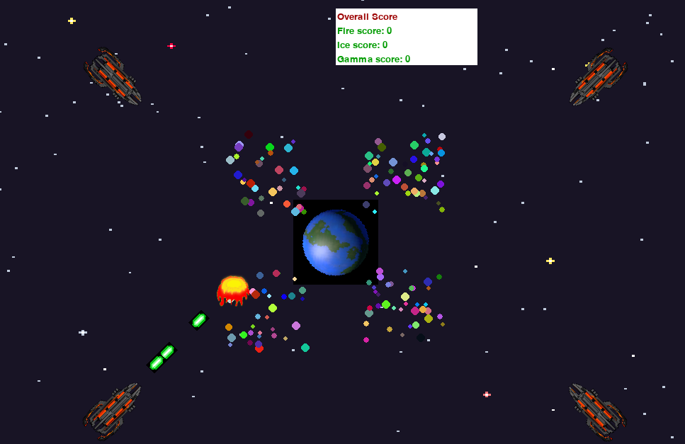

# Earth Marble Game
---
 ## Screenshot
 

 ---
This is a game that involves shooting bullets to destroy incoming marbles. The game has the following features:
- A spaceship that can shoot bullets.
- Randomly generated marbles.
- A rotating Earth image.
- Different marble densities.
- Different marble speeds.
- Different marble sizes.

## Requirements
This game requires Python 3.x and the following packages:

- Pygame

## Installation
- Clone the repository to your local machine.
- Navigate to the repository folder.
- Install the required packages using the following command:
```
pip install -r requirements.txt
```
- Run the game using command
```
python3 earth_marble_game.py

```

## How to Play
- Use the arrow keys to move the spaceship.
- Press the spacebar to shoot bullets.
- Destroy incoming marbles by shooting them.
- The game ends when a marble collides with the Earth.

## Controls
- Left arrow: move the spaceship left.
- Right arrow: move the spaceship right.
- Up arrow: move the spaceship up.
- Down arrow: move the spaceship down.
- Spacebar: shoot bullets.

## Authors
[Michael Ogaye](https://devpost.com/hogaeymic?ref_content=user-portfolio&ref_feature=portfolio&ref_medium=global-nav)

## License
 - [MIT](LICENSE)


